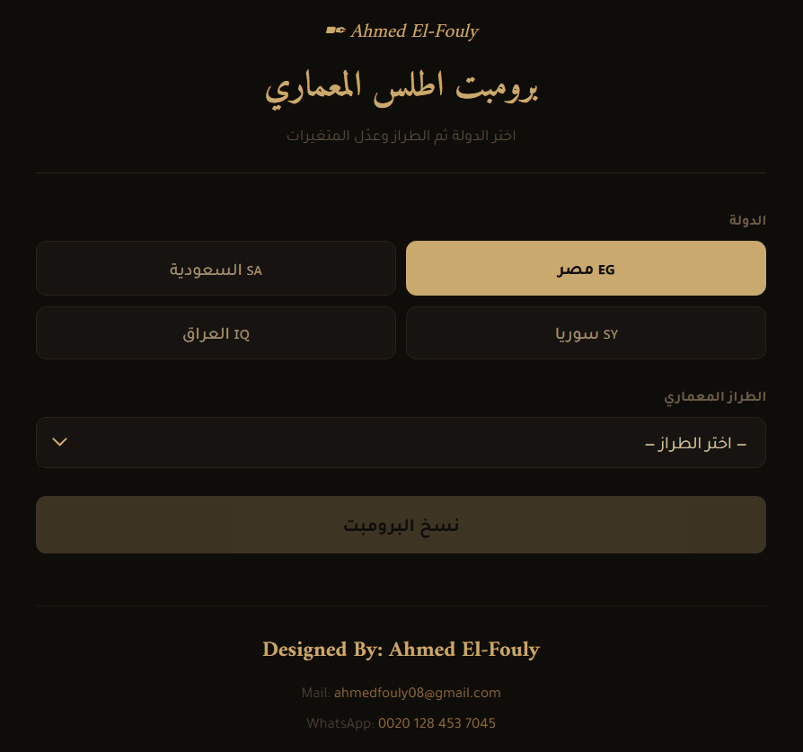

# 🏛️ ArchAtlas

  

**ArchAtlas — An interactive architectural prompt generator that explores vernacular styles across multiple countries, enabling AI-powered visualization of regional design identities.**

ArchAtlas is an interactive architectural prompt generator that explores vernacular styles across multiple countries, enabling AI-powered visualization of regional design identities.

🔗 Live Demo:
https://engfouly1987.github.io/ArchAtlas/

✨ Overview

ArchAtlas is a web-based tool designed for architects, designers, and AI creators to generate high-quality prompts inspired by real architectural styles.

It allows users to:

Select a country (Egypt, Saudi Arabia, Syria, Iraq)
Choose a specific architectural style
Customize variables (materials, proportions, climate, etc.)
Generate ready-to-use AI prompts instantly
🌍 Supported Regions & Styles

The platform currently includes:

🇪🇬 Egypt (Pharaonic, Mamluk, Coptic, Nubian, etc.)
🇸🇦 Saudi Arabia (Najdi, Hejazi, Asiri, Tihamah, etc.)
🇸🇾 Syria (Damascene, Aleppine, Umayyad, etc.)
🇮🇶 Iraq (Abbasid, Baghdadi, Mesopotamian, etc.)

Each style is carefully structured to reflect:

Cultural identity
Climate response
Material authenticity
Spatial logic
🧠 Key Features
🎯 AI-Ready Prompts — optimized for image generation tools
🏗️ Architectural Accuracy — grounded in real styles
🌍 Multi-Country Support
⚙️ Custom Variables System
📋 One-Click Copy
🎨 Clean UI/UX Interface
🖼️ Example Outputs

The tool generates prompts that produce results like:

Coastal Tihamah markets
Asiri patterned houses
Stone mountain architecture
Hejazi courtyard buildings

(See demo for full experience)

🛠️ Tech Stack
HTML5
CSS3
Vanilla JavaScript
GitHub Pages (Deployment)
🚀 Getting Started
Run locally:
git clone https://github.com/engfouly1987/ArchAtlas.git
cd ArchAtlas

Then open:

index.html
📦 Deployment

This project is deployed using GitHub Pages:

https://engfouly1987.github.io/ArchAtlas/
🎯 Use Cases
AI Image Generation (Midjourney, DALL·E, Stable Diffusion)
Architectural concept exploration
Cultural design studies
Prompt engineering for architecture
🤝 Contributing

Contributions are welcome!

If you'd like to:

Add new countries or styles
Improve prompts
Enhance UI

Feel free to fork the repo and submit a pull request.

📄 License

This project is open-source and available under the MIT License.

👤 Author

Ahmed El-Fouly
📧 ahmedfouly08@gmail.com

📱 WhatsApp: +20 128 453 7045

⭐ Support

If you like this project, consider giving it a ⭐ on GitHub!
